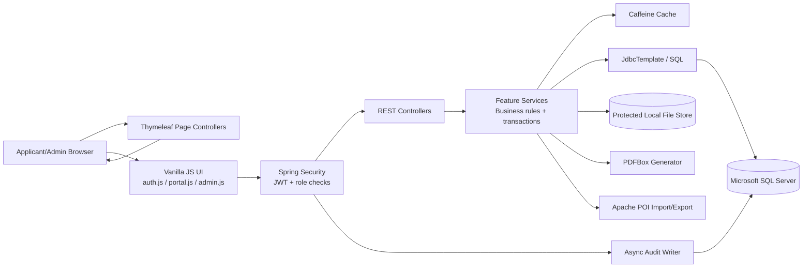
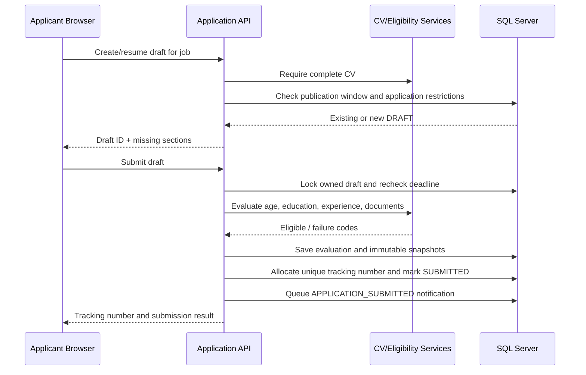

# Career Portal — Application and Architecture Overview

> Repository-backed system documentation  
> Application: Uttara Bank Career Portal  
> Snapshot reviewed: 3 August 2026  
> Main entry point: `com.uttarabank.careerportal.CareerPortalApplication`

## 1. Executive summary

Career Portal is a web-based recruitment management system for publishing bank jobs, registering applicants, building reusable applicant CV profiles, receiving applications, evaluating eligibility, shortlisting candidates, arranging recruitment exams, allocating seats and roll numbers, publishing admit cards, and auditing administrative activity.

The system serves two principal user groups:

- **Applicants**, who register, build a CV, upload documents, browse jobs, submit applications, and view published admit cards.
- **HR/system administrators**, who manage jobs, review and export applications, configure shortlist stages, record results, organize exams, generate admit-card data, and inspect audit logs.

Technically, the project is a **modular monolith** built with Java 21 and Spring Boot 4.1.0. It combines:

- server-rendered Thymeleaf page shells;
- browser-side vanilla JavaScript that calls JSON REST APIs;
- stateless JWT authentication;
- feature-oriented controller/service packages;
- direct SQL persistence through Spring `JdbcTemplate`;
- Microsoft SQL Server as the system of record; and
- Flyway-managed, SQL-first schema evolution.

It does **not** use Hibernate/JPA entities, a separate SPA framework, microservices, or a repository/ORM abstraction.

## 2. Product scope and actors

### 2.1 Applicant capabilities

An applicant can:

1. Register using a full name, email, Bangladeshi mobile number, and password.
2. Sign in using a supported login identifier.
3. Receive a permanent CV number.
4. Maintain personal and contact information.
5. Maintain present and permanent addresses using division, district, and upazila master data.
6. Add education, employment experience, training, language proficiency, extracurricular activities, and references.
7. Upload and retrieve required identity/profile documents.
8. See CV completion and missing-section information.
9. Browse currently published jobs and view circular PDFs.
10. Create/resume a draft application.
11. Submit a complete, eligible application and receive a unique eight-digit tracking number.
12. Review submitted application snapshots.
13. View published recruitment exam/admit-card information and associated application documents.

### 2.2 Administrator capabilities

An HR or system administrator can:

1. View recruitment dashboard statistics.
2. Create and edit job postings and requirement rules.
3. Upload a job circular PDF.
4. move jobs through approval, publication, closure, and deletion/archive workflows.
5. Search applications by job, tracking number, CV number, contact details, name, eligibility, and submission date.
6. View complete submitted application snapshots and documents.
7. Export filtered applications to XLSX.
8. View registered users.
9. Create configurable recruitment stages and shortlist eligible candidates.
10. Import/export shortlist decisions through XLSX and optionally queue notifications.
11. Record stage results such as passed, failed, or absent.
12. Create recruitment exam events.
13. Select candidates, allocate six-digit rolls, configure centers and rooms, auto-assign seats, generate exam records, and publish them.
14. Inspect applicant admit-card data.
15. Generate and inspect demo admit-card PDFs in background batches.
16. Search and print detailed site-activity audit logs.

## 3. Architecture

### 3.1 Architectural style

The application uses a **feature-modular layered monolith**:

- **Monolith:** one Spring Boot process and one deployable JAR contain the UI, API, business logic, and database access.
- **Feature modularity:** Java packages are organized around business capabilities such as `auth`, `applicant`, `application`, `job`, and `recruitment`.
- **Layers within features:** controllers handle HTTP, services own business rules and transactions, and services access SQL Server directly through `JdbcTemplate`.
- **Hybrid web delivery:** Thymeleaf renders page structure, while JavaScript retrieves and mutates live data through REST endpoints.
- **SQL-first persistence:** migrations, constraints, indexes, locking hints, and SQL statements define persistence behavior; there is no ORM domain mapping.

This architecture is appropriate for a cohesive recruitment product where modules share transactions and a common relational model, while still keeping business capabilities separated in code.

### 3.2 High-level component view



### 3.3 Request flow

For a typical protected API request:

1. The browser reads the access token from `localStorage`.
2. JavaScript sends `Authorization: Bearer <token>`.
3. `CorrelationIdFilter` assigns or propagates a request correlation ID.
4. `JwtAuthenticationFilter` verifies the signed token and builds the Spring Security principal and authorities.
5. `SecurityConfig` checks whether the route is public, authenticated, or admin-only.
6. `SiteActivityFilter` measures the request and prepares an audit event.
7. A REST controller validates the request DTO and calls a feature service.
8. The service applies ownership, state, eligibility, and transaction rules and executes parameterized SQL through `JdbcTemplate`.
9. `GlobalExceptionHandler` converts expected and unexpected failures into a consistent API error structure.
10. Audit events are queued and batch-written asynchronously through a dedicated audit connection pool.

### 3.4 Package/module map

| Package       | Responsibility                                                                                                          |
| ------------- | ----------------------------------------------------------------------------------------------------------------------- |
| `auth`        | Applicant registration, general/applicant/admin login, password verification, JWT issuance                              |
| `security`    | Spring Security policy, JWT signing/verification, request authentication, current-user access, optional admin bootstrap |
| `applicant`   | Applicant profile, addresses, education, experience, training, languages, activities, references, CV completeness       |
| `file`        | Document validation, protected storage, metadata, applicant/admin document retrieval                                    |
| `masterdata`  | Divisions, districts, upazilas, qualifications, subjects, institutions, departments                                     |
| `job`         | Public job catalogue, admin job lifecycle, job requirements, schedules, circular PDFs                                   |
| `application` | Draft creation, application submission, snapshots, tracking-number allocation                                           |
| `eligibility` | Age, education, experience, and mandatory-document evaluation                                                           |
| `recruitment` | Admin dashboards, application search/export, shortlisting, exams, rooms, seats, rolls, admit cards                      |
| `demo`        | Background demo admit-card PDF generation and separate database pool                                                    |
| `audit`       | HTTP activity classification, asynchronous audit persistence, audit search                                              |
| `common`      | API errors, exception translation, correlation IDs, caching, connection-pool diagnostics                                |
| `web`         | Thymeleaf route-to-template mapping and web resource configuration                                                      |

## 4. Technology stack and libraries

### 4.1 Runtime and build

| Technology               | Version/configuration | Purpose                                                                    |
| ------------------------ | --------------------- | -------------------------------------------------------------------------- |
| Java                     | 21                    | Application language/runtime                                               |
| Maven Wrapper            | Repository-provided   | Reproducible build and dependency execution                                |
| Spring Boot              | 4.1.0                 | Application bootstrap, configuration, embedded server, dependency platform |
| Spring Boot Maven Plugin | Parent-managed        | Executable JAR packaging and application execution                         |

### 4.2 Spring and application libraries

| Dependency                       | Purpose in this project                                                 |
| -------------------------------- | ----------------------------------------------------------------------- |
| `spring-boot-starter-webmvc`     | REST controllers, MVC page controllers, filters, multipart HTTP support |
| `spring-boot-starter-thymeleaf`  | Server-rendered HTML pages and reusable fragments                       |
| `spring-boot-starter-validation` | Jakarta Bean Validation on API request records                          |
| `spring-boot-starter-security`   | Stateless endpoint authorization and BCrypt password support            |
| `spring-boot-starter-jdbc`       | `JdbcTemplate`, transactions, HikariCP integration                      |
| `spring-boot-starter-cache`      | Spring cache abstraction                                                |
| Caffeine                         | In-process caches for master data and public jobs                       |
| `spring-boot-starter-actuator`   | Operational health endpoint                                             |
| `spring-boot-starter-flyway`     | Database migration lifecycle on startup                                 |
| `flyway-sqlserver`               | SQL Server-specific Flyway support                                      |
| Microsoft `mssql-jdbc`           | SQL Server JDBC driver                                                  |
| Springdoc OpenAPI UI 3.0.0       | Generated OpenAPI JSON and Swagger UI                                   |
| Nimbus JOSE JWT 10.5             | HMAC JWT creation and validation                                        |
| Apache PDFBox 3.0.8              | Demo admit-card PDF construction                                        |
| Apache POI OOXML 5.5.1           | XLSX application export and shortlist import/export                     |
| Spring Boot Test                 | JUnit-based unit/integration test support                               |
| Spring Security Test             | Security test utilities                                                 |

Transitive platform components include the embedded servlet server and HikariCP connection pooling managed by Spring Boot.

### 4.3 Frontend stack

The frontend deliberately avoids a JavaScript framework:

- Thymeleaf templates provide layouts and reusable fragments.
- `app.css` contains the shared responsive visual system.
- `auth.js` manages registration/login.
- `portal.js` manages applicant screens and API calls.
- `admin.js` manages administration screens and API calls.
- The browser Fetch API is used for REST and file requests.
- Session storage provides short-lived client-side GET caching.
- Local storage holds the JWT and role list.

## 5. Bootstrapping and configuration

`CareerPortalApplication` is intentionally small. `@SpringBootApplication` enables component scanning and auto-configuration, while `@EnableCaching` activates Spring caching. The default auto-configured in-memory user service is excluded because authentication is database/JWT based.

Configuration lives in `src/main/resources/application.yml` and can import a local `.env` properties file.

### 5.1 Important environment variables

| Variable                         | Default                   | Meaning                                                                  |
| -------------------------------- | ------------------------- | ------------------------------------------------------------------------ |
| `SERVER_PORT`                    | `8000`                    | HTTP port                                                                |
| `DB_HOST`                        | `localhost`               | SQL Server host                                                          |
| `DB_PORT`                        | `1433`                    | SQL Server port                                                          |
| `DB_NAME`                        | `CareerPortal`            | Database name                                                            |
| `DB_USERNAME`                    | `sa`                      | Database user                                                            |
| `DB_PASSWORD`                    | empty                     | Database password; must be supplied outside source control               |
| `DB_ENCRYPT`                     | `true`                    | Encrypt SQL Server transport                                             |
| `DB_TRUST_CERT`                  | `true` locally            | Trust self-signed development certificate; must be `false` in production |
| `DB_POOL_SIZE`                   | `20`                      | Main Hikari maximum pool size                                            |
| `DB_MIN_IDLE`                    | `2`                       | Main pool minimum idle connections                                       |
| `DB_QUERY_TIMEOUT`               | `20s`                     | `JdbcTemplate` query timeout                                             |
| `FLYWAY_BASELINE_ON_MIGRATE`     | `true`                    | Permit baseline adoption for legacy databases                            |
| `FLYWAY_BASELINE_VERSION`        | `8`                       | Legacy baseline version                                                  |
| `JWT_ISSUER`                     | `uttarabank-careerportal` | JWT issuer                                                               |
| `JWT_SECRET`                     | development placeholder   | HMAC signing secret; must be replaced in production                      |
| `JWT_ACCESS_MINUTES`             | `15`                      | Access-token lifetime                                                    |
| `FILE_STORAGE_ROOT`              | `./data/files`            | Protected document storage root                                          |
| `ADMIN_BOOTSTRAP_ENABLED`        | `false`                   | Optional initial admin creation                                          |
| `ADMIN_EMAIL` / `ADMIN_PASSWORD` | empty                     | Initial admin credentials when bootstrap is enabled                      |
| `DEMO_PDF_MAX_WORKERS`           | `4`                       | Parallel demo PDF workers                                                |

Multipart requests are limited globally to 5 MB files and 6 MB requests. Document service limits and image dimensions are also enforced independently.

## 6. Security model

### 6.1 Authentication

- Passwords are hashed with BCrypt cost factor 12.
- JWTs are signed and verified using Nimbus JOSE JWT.
- The configured secret is SHA-256-derived into the signing key.
- Tokens contain user identity and roles and expire after the configured access period.
- Authentication is stateless; server HTTP sessions are not used.
- Supported role concepts include `APPLICANT`, `HR_ADMIN`, and `SYSTEM_ADMIN`.
- A bootstrap runner can create an initial system administrator when explicitly enabled.

### 6.2 Authorization

- Static files, Thymeleaf page routes, public jobs, master data, authentication APIs, OpenAPI, and health are publicly routable.
- `/api/v1/admin/**` requires `HR_ADMIN` or `SYSTEM_ADMIN`.
- Other API routes require a valid authenticated principal.
- Applicant services derive the authenticated applicant ID instead of trusting an owner ID from the browser.
- Resource queries include ownership predicates for applicant-scoped records.

The HTML routes are public because they are page shells; their JavaScript redirects unauthenticated users and protected data still requires an authenticated API call.

### 6.3 Current security considerations

- CSRF is disabled because protected APIs use bearer tokens rather than cookie authentication.
- Storing access tokens in `localStorage` makes strong XSS prevention essential. A hardened deployment may prefer secure, HttpOnly, SameSite cookies with a matching CSRF design.
- The repository contains refresh-token and OTP schema foundations, but the current login flow issues access tokens only and does not implement complete OTP delivery/verification or refresh rotation.
- The development JWT secret and trusted SQL certificate setting must never be retained for production.
- Swagger/OpenAPI is publicly accessible in the present security policy; production exposure should be an explicit operational decision.

## 7. Major business workflows

### 7.1 Registration and login

Registration normalizes and validates applicant identifiers, checks password confirmation, creates the user and applicant profile transactionally, assigns the `APPLICANT` role, and allocates a permanent CV number. Login can be general or explicitly constrained to applicant/admin roles. Successful login returns a bearer access token, roles, and a frontend destination.

### 7.2 CV/profile building

The applicant CV is an aggregate assembled from normalized relational tables. Required personal information, addresses, education, and documents contribute to completeness. Experience and additional-information sections can be optional depending on the completion rule. The API supports CRUD for repeated child records and validates:

- parent-child geography relationships;
- dates and current-employment semantics;
- GPA/CGPA scales and grades;
- qualification/subject/institution combinations;
- normalized NID/passport uniqueness; and
- applicant ownership on every mutation.

### 7.3 Document handling

Document upload follows this path:

1. Enforce size and allowed document type.
2. Inspect magic bytes instead of trusting the browser content type.
3. Decode image files and validate configured dimensions.
4. Calculate SHA-256.
5. Store the binary under the protected filesystem root using a generated storage key.
6. Insert `file_asset` metadata.
7. Retire the previous active document of the same type.
8. Insert the active applicant-document relationship.

Documents are not exposed as public static resources. Applicant and admin content endpoints authorize access and return `Cache-Control: no-store`.

### 7.4 Job lifecycle

Administrators create job postings containing schedule, department, vacancy, employment type, description, responsibilities, application policy, age policy, education requirements, experience requirements, and document requirements. A circular PDF can be attached.

The lifecycle is state-driven:

```text
DRAFT → APPROVED → PUBLISHED → CLOSED
```

The service restricts edits and transitions based on the current state. Public job queries return only appropriate published/open records. Public-job cache entries are evicted after mutations.

### 7.5 Application submission



Submission is transactional. It prevents partial snapshots or status changes when eligibility or persistence fails. The final submitted application stores snapshots so later profile edits do not alter the historical application.

Eligibility currently checks:

- date of birth and maximum age at the job's reference date;
- exact, equivalent-level, or minimum-level education requirements;
- minimum GPA/division outcomes where configured;
- total employment months; and
- active, validated mandatory documents.

The deadline follows a half-open interval: the start instant is accepted and the end instant is rejected.

### 7.6 Administrative application review

Administrators can filter and paginate submitted applications, inspect profile/education/experience/document snapshots, download protected document content, and export the same search result set to streaming XLSX. The export uses Apache POI's `SXSSFWorkbook` to limit memory pressure for larger datasets.

### 7.7 Shortlisting and recruitment stages

Each job may have ordered recruitment stages. Defaults include MCQ/preliminary, written examination, and viva/interview, while administrators can add configurable stages.

Candidate selection supports:

- manual multi-selection;
- eligibility and job ownership checks;
- optional prerequisite that the candidate passed the immediately preceding stage;
- decision source and remarks;
- notification-outbox records;
- candidate removal;
- result recording; and
- XLSX round-trip import/export.

XLSX imports process rows independently, return selected/unselected/error counts, and report a bounded list of row errors. The current schema uses `decision_status`; migrations V59/V60 retain compatibility with legacy databases containing a required `selection_status` column.

### 7.8 Exams, seating, and admit cards

Administrators can create MCQ, written, combined, or viva exam events with start/end/reporting times and instructions. The workflow includes:

1. Add shortlisted/submitted candidates.
2. Assign globally unique six-digit roll numbers.
3. Configure exam centers and rooms with capacity.
4. Auto-assign rooms and seat numbers.
5. Generate the exam candidate/admit-card state.
6. Publish admit cards and queue notifications.
7. Record candidate results.

Applicants only see their own published cards. Admin and applicant endpoints can resolve the relevant application documents for card views.

The `demo` module is separate from the main recruitment-exam model. It generates sample PDF files asynchronously, provides progress polling, supports per-card generation, and uses a dedicated Hikari pool so long-running demo work does not monopolize the main request pool.

### 7.9 Notifications

Business operations insert events into `notification_outbox`, including application submission, shortlisting, stage results, and admit-card publication. This implements the transactional-outbox side of notification delivery. No email/SMS dispatcher is present in the reviewed repository, so rows remain pending until an external or future worker consumes them.

### 7.10 Auditing and observability

- `CorrelationIdFilter` associates API failures and activity with a correlation ID.
- `SiteActivityFilter` classifies requests, actor, target, result status, duration, network/browser details, and success.
- A bounded queue of 10,000 events feeds a single background writer.
- Events are persisted in batches of up to 100 using a dedicated Hikari pool.
- If the queue or database write fails, the event is retained only in application logs.
- Admin audit search supports extensive filtering and pagination.
- The frontend can prepare a printable audit report.
- Actuator health is publicly available at `/actuator/health`.
- `DatabasePoolDiagnostics` reports effective connection-pool settings at startup.

## 8. API organization

The generated contract is available at:

- OpenAPI JSON: `/v3/api-docs`
- Swagger UI: `/swagger-ui/index.html`

### 8.1 Public/authentication APIs

| Route family                            | Purpose                               |
| --------------------------------------- | ------------------------------------- |
| `POST /api/v1/auth/applicants/register` | Applicant registration                |
| `POST /api/v1/auth/login`               | General login                         |
| `POST /api/v1/auth/applicants/login`    | Applicant-only login                  |
| `POST /api/v1/auth/admins/login`        | Admin-only login                      |
| `GET /api/v1/jobs[/{id}]`               | Public job catalogue/details          |
| `GET /api/v1/jobs/{id}/circular`        | Public circular PDF                   |
| `GET /api/v1/master-data/**`            | Geography and recruitment master data |

### 8.2 Applicant APIs

| Route family                             | Purpose                                     |
| ---------------------------------------- | ------------------------------------------- |
| `/api/v1/me/profile`                     | Read/update core profile                    |
| `/api/v1/me/addresses`                   | Read/upsert addresses                       |
| `/api/v1/me/educations`                  | Education CRUD                              |
| `/api/v1/me/experiences`                 | Experience CRUD                             |
| `/api/v1/me/trainings`                   | Training CRUD                               |
| `/api/v1/me/languages`                   | Language CRUD                               |
| `/api/v1/me/activities`                  | Extracurricular activity CRUD               |
| `/api/v1/me/references`                  | Reference CRUD                              |
| `/api/v1/me/cv`                          | Aggregated CV/completion status             |
| `/api/v1/me/documents`                   | Document upload/list/content                |
| `POST /api/v1/jobs/{jobId}/applications` | Create/resume draft                         |
| `/api/v1/me/applications`                | List/detail/submit applications             |
| `/api/v1/me/admit-cards`                 | Published applicant cards/details/documents |

### 8.3 Administrative APIs

| Route family                     | Purpose                                                                   |
| -------------------------------- | ------------------------------------------------------------------------- |
| `/api/v1/admin/dashboard`        | Summary metrics                                                           |
| `/api/v1/admin/jobs`             | Job administration and state transitions                                  |
| `/api/v1/admin/applications`     | Application search, detail, export, protected documents                   |
| `/api/v1/admin/users`            | User listing                                                              |
| `/api/v1/admin/shortlists`       | Stages, selections, results, XLSX import/export                           |
| `/api/v1/admin/exams`            | Events, candidates, rolls, centers, rooms, seats, generation, publication |
| `/api/v1/admin/admit-cards`      | Admin card listing/details/documents                                      |
| `/api/v1/admin/demo-admit-cards` | Background demo PDF management                                            |
| `/api/v1/admin/audit-logs`       | Activity-log search                                                       |

## 9. User interface organization

### 9.1 Applicant pages

- landing page, registration, and login;
- applicant dashboard;
- six-step CV builder: personal, addresses, education, experience, additional information, documents;
- jobs list and job details;
- applications list and details; and
- admit-card list and printable details.

### 9.2 Administrator pages

- separate admin login;
- recruitment dashboard;
- job list, create/edit form, and details;
- application search and details;
- shortlist management;
- exam list/details;
- admit-card list/details;
- demo admit-card generation;
- user list; and
- audit-log search/reporting.

Thymeleaf fragments provide shared headers, sidebars, alerts, pagination, and applicant profile step navigation. The rendered HTML mostly supplies semantic structure; JavaScript loads current state and attaches event handlers based on page elements and route IDs.

## 10. Data architecture

### 10.1 Main data groups

| Group                  | Principal tables                                                                                                                                                                                  |
| ---------------------- | ------------------------------------------------------------------------------------------------------------------------------------------------------------------------------------------------- |
| Identity/security      | `user_account`, `role`, `user_role`, `otp_challenge`, `refresh_token`                                                                                                                             |
| Applicant CV           | `applicant_profile`, `applicant_address`, `applicant_education`, `applicant_experience`, `applicant_training`, `applicant_language`, `applicant_extracurricular_activity`, `applicant_reference`  |
| Master data            | `division`, `district`, `upazila`, `qualification`, `subject`, `institution`, `department`                                                                                                        |
| Files                  | `file_asset`, `applicant_document`                                                                                                                                                                |
| Jobs/rules             | `recruitment_circular`, `circular_application_policy`, `job_posting`, `job_circular_pdf`, `job_age_policy`, `job_education_requirement`, `job_experience_requirement`, `job_document_requirement` |
| Applications           | `job_application`, `eligibility_evaluation`, application profile/education/experience snapshots, `application_document`, `application_status_history`                                             |
| Recruitment stages     | `recruitment_stage`, `stage_candidate`, `shortlist_batch`                                                                                                                                         |
| Exams                  | `recruitment_exam`, `recruitment_exam_center`, `recruitment_exam_room`, `recruitment_exam_candidate`                                                                                              |
| Integration/operations | `notification_outbox`, `audit_log`                                                                                                                                                                |

### 10.2 Data-design characteristics

- Identity primary keys are predominantly SQL Server `BIGINT IDENTITY`.
- Foreign keys express ownership and aggregate relationships.
- Unique constraints protect emails, mobile numbers, CV numbers, tracking numbers, job codes, candidate membership, rolls, and room seats.
- Check constraints enforce dates, capacity, statuses, and result formats.
- Filtered indexes enforce one active applicant document per type and optional unique values.
- Application snapshots separate mutable CV data from historical submissions.
- `rules_version` ties a draft/application to the job rules under which it was created.
- UTC database timestamps use `SYSUTCDATETIME()`.
- Indexes support common application, job-window, education/experience, outbox, audit, and exam queries.

### 10.3 Schema migration strategy

Flyway executes versioned SQL files from `src/main/resources/db/migration`. The history currently runs from V1 through V60. Early migrations create the normalized model; later migrations deliberately repair schema drift in older installations, seed Bangladesh geography/master data, expand job policies and snapshots, introduce audit/exam/shortlist modules, and reconcile legacy constraints.

Because Flyway validates checksums, an applied migration must be treated as immutable. Any later schema correction should use a new migration version. `baseline-on-migrate` and baseline version 8 support adoption of older pre-Flyway databases, but production baselining should be controlled and backed up.

## 11. Transactions, consistency, and concurrency

Spring `@Transactional` is placed on multi-step mutations including registration, applicant aggregate writes, document metadata changes, job mutations, draft/submission, shortlist selection/import, and exam state changes.

Notable consistency techniques include:

- database uniqueness as the final duplicate guard;
- `UPDLOCK`/`HOLDLOCK` when locking draft applications and allocating unique values;
- state predicates in update statements;
- immutable submitted snapshots;
- notification outbox inserts in the owning business transaction;
- version columns on key records; and
- transaction rollback when eligibility or downstream writes fail.

The application uses direct Java-generated random eight-digit tracking numbers with a locked uniqueness check. The schema still contains historical sequence foundations from earlier designs.

## 12. Caching and performance

Two local Caffeine caches are configured:

| Cache        |         Limit |                 Expiry | Use                                                            |
| ------------ | ------------: | ---------------------: | -------------------------------------------------------------- |
| `masterData` | 1,000 entries | 30 minutes after write | Geography, qualifications, subjects, institutions, departments |
| `publicJobs` |    10 entries | 10 seconds after write | Public active-job list                                         |

Job mutations evict the public-job cache. Because these caches are in-process, each application instance has independent cache state; a multi-instance deployment would need either short TTL tolerance or a shared/invalidation strategy.

Other performance measures include SQL indexes, paginated admin searches, streaming XLSX writing, bounded audit batching, Hikari pool tuning, client session-storage caching, and a separate pool for demo/audit background workloads.

## 13. Error model

API errors use a common response containing:

- HTTP status;
- stable application error code;
- human-readable message;
- field validation errors;
- correlation ID; and
- timestamp.

The global handler maps:

- request validation to HTTP 400;
- uniqueness/state conflicts to HTTP 409;
- incomplete/ineligible applications to HTTP 422;
- database unavailability to HTTP 503 with `Retry-After`;
- selected SQL Server business error numbers to domain-specific responses; and
- unexpected failures to sanitized HTTP 500 responses while logging full server details.

## 14. Testing

The current test suite contains focused tests for:

- application entry-point presence;
- Thymeleaf page-route mappings;
- applicant-service validation;
- authentication-service validation;
- document validation; and
- demo admit-card behavior.

Tests run with:

```powershell
.\mvnw.cmd test
```

The suite currently leans toward unit/validation tests. Important future additions would include SQL Server-backed integration tests, Flyway migration tests from both clean and legacy schemas, security authorization tests for every route family, application-submission concurrency tests, XLSX round-trip tests, and end-to-end browser tests.

## 15. Build, run, and operational endpoints

### 15.1 Prerequisites

- JDK 21
- Microsoft SQL Server reachable through JDBC
- Database credentials supplied through environment or `.env`
- Writable protected file-storage directory

### 15.2 Common commands

```powershell
# Run tests
.\mvnw.cmd test

# Build executable JAR
.\mvnw.cmd clean package

# Run in development
.\mvnw.cmd spring-boot:run

# Run packaged application
java -jar target\careerportal-0.0.1-SNAPSHOT.jar
```

At startup, Flyway validates and applies pending migrations before `JdbcTemplate`-dependent services initialize. A checksum mismatch or failed migration intentionally prevents the application from serving requests.

### 15.3 Operational URLs

| URL                      | Purpose                       |
| ------------------------ | ----------------------------- |
| `/`                      | Public landing page           |
| `/login`                 | Applicant login               |
| `/admin/login`           | Administrator login           |
| `/portal/dashboard`      | Applicant application shell   |
| `/admin/dashboard`       | Administration shell          |
| `/actuator/health`       | Health status                 |
| `/v3/api-docs`           | OpenAPI JSON                  |
| `/swagger-ui/index.html` | Interactive API documentation |

## 16. Current limitations and production-readiness gaps

The following are architectural observations from the current code, not evidence that the implemented workflows are unusable:

1. **Notification delivery:** outbox events are created, but no email/SMS consumer is included.
2. **OTP and refresh tokens:** schema exists, but complete verification, recovery, refresh, and revocation flows are not implemented.
3. **File storage:** protected local disk works for a single host; clustered production should use durable object storage and malware scanning.
4. **Token storage:** browser `localStorage` increases the consequence of XSS.
5. **Rate limiting/CAPTCHA:** no application-level login/register throttling or CAPTCHA is visible.
6. **Audit durability:** the asynchronous in-memory queue can lose events on abrupt process failure, queue overflow, or database-write failure.
7. **Local caches:** Caffeine does not coordinate across multiple application instances.
8. **Demo module:** demo admit-card generation has its own tables/files and should be isolated or disabled if it is not a production requirement.
9. **Test depth:** database migrations and critical multi-step workflows need stronger integration and concurrency coverage.
10. **Public operational docs:** Swagger UI and API docs are public and should be reviewed for production exposure.
11. **Secrets/configuration:** production must replace the JWT placeholder, require trusted SQL TLS certificates, and manage secrets outside the repository.
12. **Legacy compatibility complexity:** numerous alignment migrations show that deployments may have schema drift; database backup and migration rehearsal are important.

## 17. Recommended evolution path

Near-term priorities:

1. Add migration and SQL Server integration tests covering clean and representative legacy schemas.
2. Add a transactional-outbox consumer with retry, idempotency, templates, and delivery status.
3. Complete refresh-token rotation, logout/revocation, OTP/password recovery, and rate limiting.
4. Move documents to S3-compatible protected object storage and add antivirus scanning.
5. Add browser end-to-end tests for registration, CV completion, submission, shortlisting, and admit-card publication.
6. Harden production headers, CSP, token handling, OpenAPI exposure, secret storage, and database TLS.
7. Define audit durability requirements and, if necessary, use an outbox/broker rather than an in-memory queue.

Longer-term, the modular monolith can remain the preferred architecture while load and team size are moderate. If a boundary eventually needs extraction, notification delivery, document processing, and PDF generation are clearer candidates than core application submission because they already have asynchronous or storage-oriented behavior.

## 18. Key source locations

| Area                   | Location                                                                        |
| ---------------------- | ------------------------------------------------------------------------------- |
| Entry point            | `src/main/java/com/uttarabank/careerportal/CareerPortalApplication.java`        |
| Runtime configuration  | `src/main/resources/application.yml`                                            |
| Dependencies/build     | `pom.xml`                                                                       |
| Security policy        | `src/main/java/com/uttarabank/careerportal/security/SecurityConfig.java`        |
| Applicant services     | `src/main/java/com/uttarabank/careerportal/applicant/`                          |
| Application submission | `src/main/java/com/uttarabank/careerportal/application/ApplicationService.java` |
| Eligibility engine     | `src/main/java/com/uttarabank/careerportal/eligibility/EligibilityService.java` |
| Job lifecycle          | `src/main/java/com/uttarabank/careerportal/job/`                                |
| Recruitment workflows  | `src/main/java/com/uttarabank/careerportal/recruitment/`                        |
| File protection        | `src/main/java/com/uttarabank/careerportal/file/DocumentService.java`           |
| Audit pipeline         | `src/main/java/com/uttarabank/careerportal/audit/`                              |
| Page routing           | `src/main/java/com/uttarabank/careerportal/web/PageController.java`             |
| Templates              | `src/main/resources/templates/`                                                 |
| Browser code           | `src/main/resources/static/js/`                                                 |
| Database migrations    | `src/main/resources/db/migration/`                                              |
| Tests                  | `src/test/java/com/uttarabank/careerportal/`                                    |

## 19. Architectural conclusion

Career Portal is a coherent SQL-centric Spring modular monolith. Its strongest design features are explicit transactional services, database-enforced integrity, immutable application snapshots, configurable recruitment stages, a clear applicant/admin separation, protected document access, searchable auditing, and a pragmatic server-rendered/REST hybrid UI.

The architecture is currently optimized for straightforward deployment and strong relational consistency rather than distributed scaling. That is a sound fit for the domain. Production maturity now depends less on changing the core architecture and more on completing external integrations, strengthening security operations, making audit/notification delivery durable, and expanding integration and end-to-end testing.
